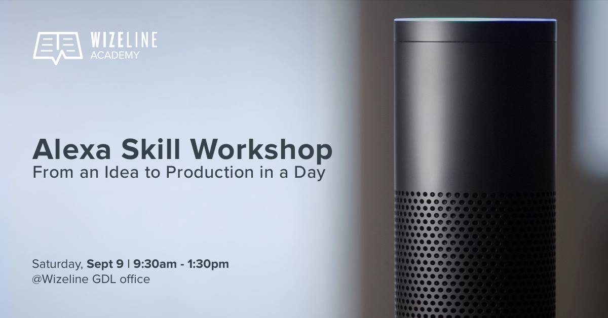

# Wizeline Academy: Alexa Workshop



Hi! Welcome to Wizeline Academy: Alexa Workshop.

Before the Alexa Workshop, and to ensure a better workshop experience, please make sure you complete the prerequisites listed on this document before the event.

## Prerequisites

This is the list of prerequisities that you'll need to complete before the event starts.
- [Create an AWS Personal account](#create-an-aws-personal-account)
- [Create an Amazon Developer Account](#create-an-amazon-developer-account)
- [Install Node.js](#install-nodejs)
- [Install Git](#install-git)

### Create an AWS Personal Account

To create an AWS Personal Account follow [this Amazon instructions](http://docs.aws.amazon.com/AmazonSimpleDB/latest/DeveloperGuide/AboutAWSAccounts.html).

To test your __AWS Personal Account__:
1. Go to https://aws.amazon.com/
2. Select My Account > AWS Management Console from the top menu bar.
3. Fill in your email.
4. Click the Next button.
5. Fill in your Password.
6. Click the Sign In button.

### Create an Amazon Developer Account

To create an Amazon Developer account follow these steps:
1. Go to https://developer.amazon.com/
2. Click **Sign In** from the top menu.
3. Select **Create your Amazon Developer account** or visit [this link](https://www.amazon.com/ap/register?openid.pape.max_auth_age=1&openid.return_to=https%3A%2F%2Fdeveloper.amazon.com%2Fap_login.html&prevRID=48Y5JW117M51F2T37XZJ&openid.identity=http%3A%2F%2Fspecs.openid.net%2Fauth%2F2.0%2Fidentifier_select&openid.assoc_handle=mas_dev_portal&openid.mode=checkid_setup&prepopulatedLoginId=&failedSignInCount=0&language=en_US&openid.claimed_id=http%3A%2F%2Fspecs.openid.net%2Fauth%2F2.0%2Fidentifier_select&pageId=amzn_developer_portal&openid.ns=http%3A%2F%2Fspecs.openid.net%2Fauth%2F2.0).
4. Fill in your name, email, and password.
5. Click **Create your Amazon Developer account**.

To test your account for the __Amazon Developer Portal__:
1. Go to https://developer.amazon.com/
2. Click **Sign In** from the top menu.
3. Fill in your email, and password.
4. Click the **Sign In** button.

### Install Node.js

For the best experience and to avoid version conflicts with Amazon Lambda, we recommend using **v6.10.3**.

If you're using OS X or Windows, the best way to install Node.js is to use one of the installers from the [Node.js download page](https://nodejs.org/en/download/releases/). If you're using Linux, you can use the installer, or you can check [NodeSource's binary distributions](https://github.com/nodesource/distributions) to see whether or not there's a more recent version that works with your system.

To test your installation: 
Run **node -v** in your console. The version should be **6.10.3**.


### Install Git

To install Git in your console, follow [this tutorial](https://git-scm.com/book/en/v2/Getting-Started-Installing-Git).

**Note:** If you’re new to Git, don’t worry. [Here’s a cheat sheet from GitHub](https://services.github.com/on-demand/downloads/github-git-cheat-sheet.pdf) that could help you get started. However, everything that you need to know will be covered during the workshop.

To test your installation:
1. Using your conosle, navigate to the folder you want to use to download the Alexa Workshop repository.
   For example,
   ```
   cd Documents
   ```
2. Run **git clone https://github.com/wizelineacademy/AlexaWorkshop.git** in your console. You should be able to see the AlexaWorkshop files in your computer.

If you prefer using a visual application for Git, we recommend [GitHub Desktop](https://desktop.github.com/).